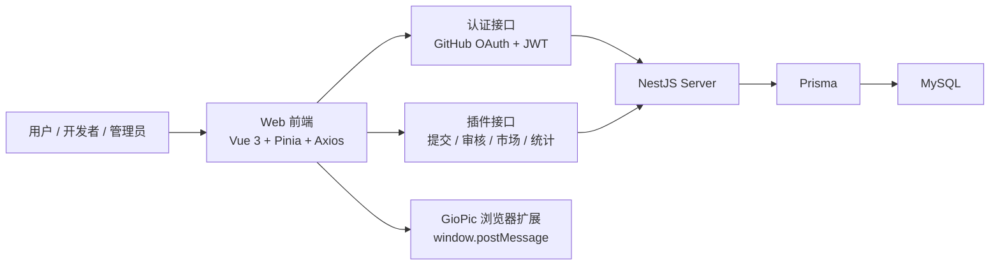

# FileUp 后端架构说明

本文档基于当前仓库中的真实实现整理，覆盖：

- `server/` 中的 NestJS + Prisma + MySQL 后端
- `web/fileup.dev/` 中的 Vue 3 前端页面、状态管理和请求层
- UI 字段、接口字段、数据库字段之间的对应关系

这不是一份“理想化设计稿”，而是当前代码已经落地的后端架构说明。

## 1. 系统概览



系统分成四层：

1. `web/fileup.dev` 负责页面展示、表单编辑、登录态管理、插件安装交互。
2. `server/src/auth` 负责 GitHub OAuth、JWT 签发、当前用户信息返回。
3. `server/src/plugins` 负责插件提交、审核、可见性控制、市场列表和下载统计。
4. `server/prisma/schema.prisma` 定义用户、插件、插件版本和下载记录四个核心模型。

## 2. 技术栈与运行时约定

### 2.1 前端

- Vue 3
- Vue Router
- Pinia
- Axios
- Naive UI

### 2.2 后端

- Node.js
- NestJS
- Prisma Client
- MySQL
- Passport GitHub OAuth
- Passport JWT

### 2.3 服务启动约定

后端在 `server/src/main.ts` 中有几个关键运行时行为：

- 全局路由前缀为 `/api`
- `enableCors()` 全开放
- `BigInt` 统一序列化为 `Number`
- 静态目录为 `server/public`

这意味着后端逻辑路由实际都是 `/api/auth/...`、`/api/plugins/...`。

### 2.4 环境变量

当前实现依赖以下环境变量：

| 变量 | 用途 |
|---|---|
| `DATABASE_URL` | MySQL 连接串 |
| `JWT_SECRET` | JWT 签名密钥 |
| `FRONTEND_URL` | GitHub 登录成功后重定向回前端的地址 |
| `GITHUB_CLIENT_ID` | GitHub OAuth App Client ID |
| `GITHUB_CLIENT_SECRET` | GitHub OAuth App Client Secret |
| `GITHUB_CALLBACK_URL` | GitHub OAuth 回调地址 |
| `PORT` | NestJS 监听端口 |

## 3. 模块划分

| 模块 | 代码位置 | 职责 |
|---|---|---|
| `PrismaModule` | `server/src/prisma` | 提供 PrismaService，统一访问数据库 |
| `UsersModule` | `server/src/users` | 用户查询与 GitHub 登录后自动建档 |
| `AuthModule` | `server/src/auth` | GitHub OAuth、JWT 签发、`/auth/me` |
| `PluginsModule` | `server/src/plugins` | 插件提交、查询、审核、上下架、删除、下载统计 |

## 4. 数据模型

### 4.1 `User`

对应 Prisma 模型：`User`

| 字段 | 类型 | 说明 |
|---|---|---|
| `id` | `String` | 主键，`uuid()` |
| `githubId` | `String` | GitHub 账户唯一 ID，唯一索引 |
| `username` | `String` | GitHub 用户名 |
| `avatar` | `String?` | GitHub 头像 |
| `role` | `Role` | `DEVELOPER` 或 `ADMIN` |
| `createdAt` | `DateTime` | 创建时间 |

关系：

- `User.plugins`：用户提交的插件
- `User.reviewedVersions`：管理员审核过的版本

### 4.2 `Plugin`

对应 Prisma 模型：`Plugin`

| 字段 | 类型 | 说明 |
|---|---|---|
| `id` | `String` | 插件主键，例如 `org.example.plugin` |
| `authorId` | `String` | 提交者用户 ID |
| `name` | `String` | 当前展示名称 |
| `description` | `String` | 当前展示描述 |
| `icon` | `String` | 当前展示图标，既可能是 URL，也可能是图标 class |
| `downloads` | `BigInt` | 下载累计计数 |
| `isPublic` | `Boolean` | 是否对市场可见 |
| `adminDisabled` | `Boolean` | 是否被管理员强制下架 |
| `createdAt` | `DateTime` | 创建时间 |
| `updatedAt` | `DateTime` | 最后更新时间 |

职责：

- 存储插件“当前对外展示”的摘要字段
- 绑定插件归属人 `authorId`
- 作为所有版本的聚合根

### 4.3 `PluginVersion`

对应 Prisma 模型：`PluginVersion`

| 字段 | 类型 | 说明 |
|---|---|---|
| `id` | `String` | 主键，`uuid()` |
| `pluginId` | `String` | 关联 `Plugin.id` |
| `version` | `String` | 插件版本号 |
| `content` | `Json` | 完整插件 JSON 内容，是真正的安装载荷 |
| `changelog` | `String?` | 更新日志 |
| `status` | `PluginStatus` | `PENDING` / `APPROVED` / `REJECTED` |
| `auditLog` | `String?` | 审核日志 |
| `auditorId` | `String?` | 审核管理员 ID |
| `createdAt` | `DateTime` | 提交时间 |

关键点：

- 审核状态是“按版本”管理的，不是按插件主表管理的
- `content` 才是插件最终被扩展安装的真实数据
- 唯一约束为 `@@unique([pluginId, version])`

### 4.4 `PluginDownload`

对应 Prisma 模型：`PluginDownload`

| 字段 | 类型 | 说明 |
|---|---|---|
| `id` | `String` | 主键，`uuid()` |
| `pluginId` | `String` | 关联 `Plugin.id` |
| `ip` | `String` | 下载来源 IP |
| `createdAt` | `DateTime` | 下载时间 |

职责：

- 保存下载事件原始记录
- 用于 10 秒内同 IP 去重

### 4.5 关系与约束

- `Plugin.authorId -> User.id`
- `PluginVersion.pluginId -> Plugin.id`
- `PluginVersion.auditorId -> User.id`
- `PluginDownload.pluginId -> Plugin.id`
- 删除 `Plugin` 时，版本和下载记录级联删除
- 下载记录建有 `@@index([pluginId, ip])`

## 5. 插件数据的“双层模型”

当前实现里，插件数据分成两层：

1. `Plugin` 主表摘要字段
2. `PluginVersion.content` 完整 JSON

这两层不是完全等价的，而是分工不同。

### 5.1 主表摘要字段

用于：

- 市场卡片展示
- 开发者控制台摘要展示
- 管理后台摘要展示

字段包括：

- `name`
- `description`
- `icon`
- `downloads`
- `isPublic`
- `updatedAt`

### 5.2 `content` 完整 JSON

用于：

- 插件安装载荷
- 审核时查看脚本与配置
- 提交页自动填充与双向同步
- 市场页显示作者名的补充来源

前端实际依赖的 `content` 常用字段如下：

| `content` 字段 | 用途 |
|---|---|
| `id` | 插件唯一 ID |
| `name` | 插件名称 |
| `version` | 版本号 |
| `description` | 描述 |
| `icon` | 图标 |
| `author` | 展示作者名，可为字符串或对象 |
| `script` | 上传脚本 |
| `inputs` | 插件配置项定义数组 |

其中 `inputs` 在提交页、审核页和市场详情里，已经不再只是“静态表单描述”，常见子字段包括：

- `name`
- `label`
- `type`
- `required`
- `default`
- `placeholder`
- `help`
- `options`
- `filterable`
- `clearable`
- `tag`
- `multiple`
- `visibleWhen`
- `disabledWhen`
- `dataSource.watch`
- `dataSource.required`
- `dataSource.manual`
- `dataSource.actionLabel`
- `dataSource.script`

关键耦合点：

- `content.script` 是上传脚本字符串
- `content.inputs[].dataSource.script` 是配置阶段脚本字符串
- 市场安装时必须把完整 `content` 原样发给扩展，不能只取摘要字段后自行重建
- 审核页如果只展示顶层 `script`，会漏掉字段级配置脚本

后端当前不会对 `content` 做严格 schema 校验。

## 6. UI 字段、接口字段、数据库字段映射

### 6.1 登录态与用户信息

| UI / Store 字段 | 接口字段 | 数据库字段 | 说明 |
|---|---|---|---|
| `authStore.token` | GitHub 登录回跳 URL 中的 `token` | 无 | 前端存入 `localStorage` |
| `authStore.user.userId` | `/auth/me.userId` | `User.id` | JWT 校验后重新查库返回 |
| `authStore.user.username` | `/auth/me.username` | `User.username` | 登录后展示名 |
| `authStore.user.role` | `/auth/me.role` | `User.role` | 控制是否可进入管理员页面 |
| `authStore.user.avatar` | `/auth/me.avatar` | `User.avatar` | 头像展示 |

### 6.2 提交页 `SubmitPlugin.vue`

提交页表单模型：

```json
{
  "id": "",
  "name": "",
  "description": "",
  "icon": "",
  "version": "1.0.0",
  "author": "",
  "script": "",
  "content": "{}",
  "changelog": ""
}
```

字段映射如下：

| UI 字段 | 前端提交字段 | 数据库存储 | 说明 |
|---|---|---|---|
| `model.id` | `id` | `Plugin.id` / `PluginVersion.pluginId` / `content.id` | 新插件创建主表；编辑时 ID 禁止改 |
| `model.name` | `name` | `Plugin.name` / `content.name` | 已有插件只有审核通过后才同步回主表 |
| `model.description` | `description` | `Plugin.description` / `content.description` | 同上 |
| `model.icon` | `icon` | `Plugin.icon` / `content.icon` | 同上 |
| `model.version` | `version` | `PluginVersion.version` / `content.version` | 后端仅校验唯一，不校验语义版本递增 |
| `model.author` | 顶层也会随表单发送，但真正生效的是 `content.author` | `PluginVersion.content.author` | 顶层 `author` 不在 service 中单独入库 |
| `model.script` | 顶层也会随表单发送，但真正生效的是 `content.script` | `PluginVersion.content.script` | 顶层 `script` 不在 service 中单独入库 |
| `model.content` | `content` | `PluginVersion.content` | 完整插件 JSON |
| `model.changelog` | `changelog` | `PluginVersion.changelog` | 版本变更说明 |

提交前前端会做两件事：

1. 表单字段和 `content` JSON 双向同步
2. 用表单值覆盖 `content.id/name/version/description/icon/author/script`

因此后端接收时，`content` 通常已经是最终安装载荷。

### 6.3 市场页 `PluginMarketplace.vue`

市场页前端使用的 `PluginMeta`：

```json
{
  "id": "string",
  "name": "string",
  "version": "string",
  "description": "string",
  "author": {
    "username": "string",
    "avatar": "string"
  },
  "icon": "string",
  "downloads": 0,
  "installed": false,
  "enabled": false,
  "content": {},
  "updatedAt": "string"
}
```

字段来源如下：

| 市场页字段 | 前端取值 | 接口来源 | 数据库来源 |
|---|---|---|---|
| `id` | `p.id` | `GET /plugins` | `Plugin.id` |
| `name` | `p.name` | `GET /plugins` | `Plugin.name` |
| `version` | `p.versions[0].version` | `GET /plugins` | `PluginVersion.version` |
| `description` | `p.description` | `GET /plugins` | `Plugin.description` |
| `author.username` | `p.versions[0].content.author` 优先，否则 `p.author.username` | `GET /plugins` | `PluginVersion.content.author` 或 `User.username` |
| `author.avatar` | `p.author.avatar` | `GET /plugins` | `User.avatar` |
| `icon` | `p.icon` | `GET /plugins` | `Plugin.icon` |
| `downloads` | `Number(p.downloads)` | `GET /plugins` | `Plugin.downloads` |
| `content` | `p.versions[0].content` | `GET /plugins` | `PluginVersion.content` |
| `updatedAt` | `p.updatedAt` | `GET /plugins` | `Plugin.updatedAt` |
| `installed` | 扩展返回 | 无 | 不入库 |
| `enabled` | 扩展返回 | 无 | 不入库 |

注意：

- 市场页搜索和排序完全在前端完成，没有下发查询参数到后端
- 当前市场接口已经把 `content` 带回来了，所以安装时不需要再请求详情接口
- `content` 现在不仅包含上传脚本，还可能包含 `visibleWhen`、`disabledWhen`、`dataSource` 和 `inputs[].dataSource.script`
- 市场详情页、审核页、在线编辑器如果不消费这些字段，会和扩展内真实运行行为脱节
- 安装按钮必须直接把 `content` 发给扩展，而不是从卡片摘要字段重建插件对象

### 6.4 开发者控制台 `Dashboard.vue`

| 控制台字段 | 接口来源 | 数据库来源 | 说明 |
|---|---|---|---|
| `plugin.id` | `GET /plugins/my` | `Plugin.id` | 插件唯一标识 |
| `plugin.name` | `GET /plugins/my` | `Plugin.name` | 使用主表摘要，不直接用最新版本 content |
| `plugin.icon` | `GET /plugins/my` | `Plugin.icon` | 同上 |
| `plugin.isPublic` | `GET /plugins/my` | `Plugin.isPublic` | 控制公开/私有标签 |
| `plugin.versions[0].status` | `GET /plugins/my` | `PluginVersion.status` | 控制审核状态标签 |

这意味着：

- 如果开发者提交了一个新的待审核版本，且改了 `name/description/icon`
- 在审核通过前，控制台卡片仍可能显示旧的主表摘要字段
- 但 `versions[0].content` 中已经是新版本数据

### 6.5 管理审核页 `AdminReview.vue`

| 页面区域 | 接口 | 主要字段来源 |
|---|---|---|
| 待审核列表 | `GET /plugins/pending` | `Plugin` 主表摘要 + `versions[].content` |
| 全部插件列表 | `GET /plugins/admin/all` | `Plugin` 主表 + 全部 `versions` |
| 审核按钮 | `PATCH /plugins/:id/versions/:version/audit` | 修改 `PluginVersion.status` |
| 上下架按钮 | `PATCH /plugins/:id/visibility` | 修改 `Plugin.isPublic` / `adminDisabled` |
| 删除按钮 | `DELETE /plugins/:id` | 删除 `Plugin`，级联删版本和下载记录 |

审核页代码预览使用的是：

- `plugin.versions[0].content`

也就是说，真正用于审核的代码来源是 `PluginVersion.content`，不是 `Plugin` 主表。

## 7. API 设计与前后端调用映射

### 7.1 路径约定

这里有一个必须说明的现状：

- 后端在 `main.ts` 中设置了全局前缀 `/api`
- 前端 `api.ts` 中的 `API_BASE_URL` 是 `https://server.fileup.dev`
- 前端实际调用写的是 `/plugins`、`/auth/me`，没有显式带 `/api`

因此生产环境必须满足以下任一条件：

1. 反向代理把 `/plugins`、`/auth` 重写到后端 `/api/plugins`、`/api/auth`
2. 部署时 `API_BASE_URL` 实际改成带 `/api` 的地址
3. 服务端另有未提交到仓库的网关层做了路径兼容

文档下面同时列出“前端调用路径”和“后端逻辑路径”。

### 7.2 接口表

| 前端调用 | 后端逻辑路径 | 权限 | 作用 |
|---|---|---|---|
| `GET /auth/github` | `GET /api/auth/github` | 公开 | 发起 GitHub OAuth |
| `GET /auth/github/callback` | `GET /api/auth/github/callback` | 公开 | GitHub 回调，签发 JWT 并重定向到前端 |
| `GET /auth/me` | `GET /api/auth/me` | JWT | 返回当前登录用户 |
| `GET /plugins` | `GET /api/plugins` | 公开 | 市场插件列表，默认只取 `APPROVED` |
| `GET /plugins/:id` | `GET /api/plugins/:id` | 公开 | 取插件详情，只带最新 `APPROVED` 版本 |
| `GET /plugins/:id?allStatus=true` | `GET /api/plugins/:id?allStatus=true` | 公开 | 取插件详情，带最新任意状态版本，提交页编辑模式使用 |
| `POST /plugins/:id/download` | `POST /api/plugins/:id/download` | 公开 | 记录下载并做 10 秒 IP 去重 |
| `POST /plugins` | `POST /api/plugins` | JWT | 提交新插件或新版本 |
| `GET /plugins/my` | `GET /api/plugins/my` | JWT | 获取当前用户提交的插件 |
| `GET /plugins/pending` | `GET /api/plugins/pending` | JWT + `ADMIN` | 获取包含待审核版本的插件 |
| `GET /plugins/admin/all` | `GET /api/plugins/admin/all` | JWT + `ADMIN` | 获取全部插件和全部版本 |
| `PATCH /plugins/:id/versions/:version/audit` | `PATCH /api/plugins/:id/versions/:version/audit` | JWT + `ADMIN` | 审核指定版本 |
| `PATCH /plugins/:id/visibility` | `PATCH /api/plugins/:id/visibility` | JWT + 作者或管理员 | 上下架插件 |
| `DELETE /plugins/:id` | `DELETE /api/plugins/:id` | JWT + `ADMIN` | 删除插件 |

### 7.3 关键接口的真实行为

#### `GET /plugins`

后端行为：

- 默认 `status = APPROVED`
- 公开接口接受 `status` 查询参数，前端当前未使用
- 只返回 `isPublic = true` 的插件
- `versions` 只带该状态下最新的一条
- 带回 `author.username` 和 `author.avatar`

这使得市场页一次请求就能拿到：

- 卡片摘要信息
- 最新已通过审核版本号
- 完整安装用 `content`

#### `POST /plugins`

后端行为分两种：

1. 插件不存在
   - 创建 `Plugin`
   - 同时创建一个 `PENDING` 的 `PluginVersion`
2. 插件已存在
   - 必须是原作者
   - 版本号不能重复
   - 只创建新的 `PENDING` 版本
   - 主表 `name/description/icon` 不立即改，等审核通过后同步

#### `PATCH /plugins/:id/versions/:version/audit`

后端行为：

- 把目标版本状态更新为 `APPROVED` 或 `REJECTED`
- 记录 `auditorId`
- 写入固定格式 `auditLog`
- 如果是 `APPROVED`，再把 `content.name/description/icon` 同步回 `Plugin` 主表

#### `PATCH /plugins/:id/visibility`

后端行为：

- 作者和管理员都可调用
- 管理员下架时会额外把 `adminDisabled = true`
- 管理员重新上架时会把 `adminDisabled = false`
- 普通开发者如果插件已被管理员禁用，则不能自行重新上架

## 8. 核心业务流程

### 8.1 登录流程

1. 前端点击登录，跳转到 `${API_BASE_URL}/auth/github`
2. 后端经 GitHub OAuth 完成认证
3. 后端在回调中 upsert 用户，并签发 JWT
4. 后端跳转到 `${FRONTEND_URL}/auth/callback?token=...`
5. 前端 `AuthCallback.vue` 保存 token，然后请求 `/auth/me`

补充：

- 前端还注册了一个路由别名 `/api/auth/github/callback`
- 如果浏览器直接落到前端路由并带 `code` 参数，前端会再把 `code` 转发给后端回调地址

### 8.2 提交流程

1. 开发者在提交页粘贴 `plugin.json`
2. 前端把 JSON 和表单字段双向同步
3. 提交前用表单字段覆盖 `content`
4. 前端调用 `POST /plugins`
5. 后端根据插件是否已存在，创建新插件或新版本
6. 新版本状态固定为 `PENDING`

### 8.3 审核流程

1. 管理员打开审核页，请求 `GET /plugins/pending`
2. 页面展示插件摘要和 `versions[0].content`
3. 管理员点击通过/拒绝
4. 后端更新对应 `PluginVersion.status`
5. 通过时同步主表摘要字段

### 8.4 市场安装流程

1. 市场页请求 `GET /plugins`
2. 前端把返回值转成 `PluginMeta`
3. 若检测到 GioPic 扩展已安装，则拉取已安装插件状态
4. 用户点击安装时：
   - 直接使用列表接口里返回的 `content`
   - 不要丢弃 `inputs[].dataSource.script`、`visibleWhen`、`disabledWhen` 等嵌套字段
   - 组装成安装 payload
   - 调用 `POST /plugins/:id/download`
   - 通过 `window.postMessage` 发给浏览器扩展

因此当前实现里，“市场列表接口”已经承担了“详情接口 + 安装载荷接口”的职责。
在这次插件系统升级后，这个 `content` 还同时承担了“配置脚本载荷”的职责。

### 8.5 上下架与删除流程

- 开发者控制台可上下架自己的插件
- 管理员审核页可上下架任意插件
- 只有管理员可以删除插件
- 删除 `Plugin` 时，版本和下载记录会一并被删除

## 9. 当前实现的事实与边界

以下内容不是建议，而是当前代码的真实边界：

1. 后端没有对提交 DTO 使用 `class-validator` 做严格校验，`content` 结构也没有 schema 校验。
2. 后端没有校验“新版本号必须大于旧版本号”，只校验同一插件下版本号不能重复。
3. 市场页搜索和排序都在前端内存中完成，后端没有分页、搜索、排序参数。
4. 市场列表接口会返回完整 `content`，脚本越大，列表响应越重。
5. 审核拒绝没有填写理由的 UI，`auditLog` 只写固定文案。
6. `GET /plugins/pending` 可能返回一个插件的多个待审核版本，但审核页只使用 `versions[0]`。
7. 对于已有插件的新待审核版本，`Plugin` 主表摘要字段在审核通过前不会更新，所以控制台和部分管理视图可能看到旧名称、旧描述、旧图标。
8. 下载去重规则只有“同一 IP 10 秒内只计一次”，属于轻量级防刷。
9. `enableCors()` 当前是全开放策略。
10. 新用户默认角色为 `DEVELOPER`，管理员角色需要数据库侧人工维护。
11. `GET /plugins` 的 `status` 查询参数当前未做权限限制，公开请求可尝试读取 `PENDING` 或 `REJECTED` 版本，只要插件本身仍是 `isPublic = true`。
12. `GET /plugins/:id?allStatus=true` 当前也是公开接口，会返回该插件最新的任意状态版本。
13. `GET /plugins/:id` 没有限制 `isPublic`，只是把返回的 `versions` 过滤为 `APPROVED`；如果知道插件 ID，仍可读到主表摘要字段。

## 10. 总结

当前后端的核心建模方式可以概括为：

- `Plugin` 负责摘要、归属、可见性和统计
- `PluginVersion` 负责版本、审核状态和完整插件 JSON
- `PluginDownload` 负责轻量下载统计
- `User` 负责 GitHub 身份和角色

前端页面并不是直接等价于数据库表，而是围绕 `Plugin` 摘要字段和 `PluginVersion.content` 完整载荷做了组合展示。理解这层“双层模型”，是后续继续演进提交、审核、市场和安装逻辑的关键。


