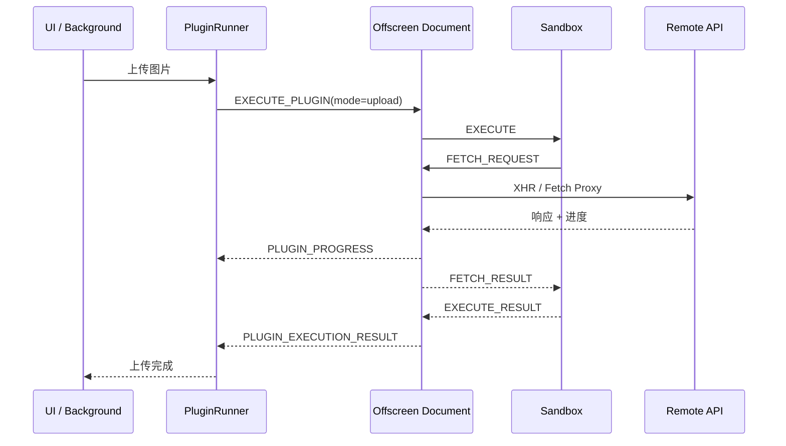
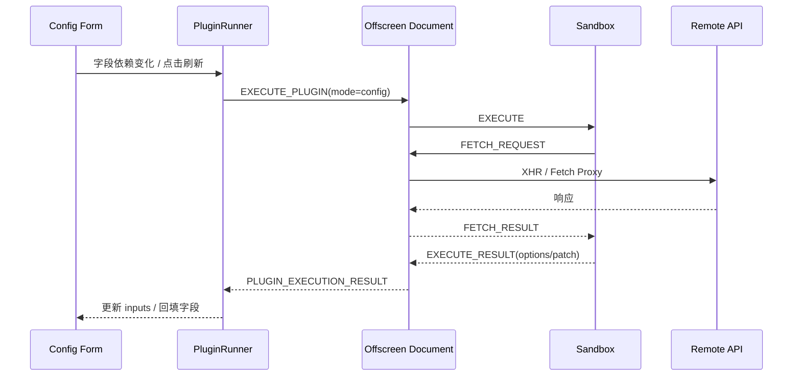

# GioPic 插件系统架构解析

本文档描述 GioPic 在 Manifest V3 下的插件执行架构。当前插件系统同时支持两类任务：
- 上传阶段脚本：处理真实文件上传
- 配置阶段脚本：在表单填写时动态请求远端 API，生成下拉选项或回填字段

两类任务都复用同一条安全执行链路：`UI / Background -> Offscreen Document -> Sandbox iframe`。

## 目录结构

```text
src/
├── offscreen/
│   ├── offscreen.html
│   └── offscreen.ts
├── sandbox/
│   ├── index.html
│   └── sandbox.ts
└── services/
    └── pluginRunner.ts
```

## 核心模块

### 1. Plugin Runner (`src/services/pluginRunner.ts`)

角色：调度器

职责：
- 确保 Offscreen Document 可用
- 对沙箱做 `PING / PONG` 健康检查
- 将上传任务和配置任务统一封装成 `EXECUTE_PLUGIN`
- 跟踪任务结果与上传进度

### 2. Offscreen Document (`src/offscreen/`)

角色：中转代理

职责：
- 接收 `EXECUTE_PLUGIN`
- 将任务转发给 Sandbox iframe
- 代理 `ctx.fetch` 请求
- 用 `XMLHttpRequest` 发送真实网络请求，以支持上传进度
- 将 `PLUGIN_EXECUTION_RESULT` / `PLUGIN_PROGRESS` 回传给扩展运行时

### 3. Sandbox (`src/sandbox/`)

角色：受限执行环境

职责：
- 解析插件脚本
- 注入受限的 `ctx` 能力
- 执行配置脚本或上传脚本
- 通过 `postMessage` 与 Offscreen 通信

## 两类脚本的执行模型

### 上传脚本

函数签名：

```js
return async function(config, file, ctx) {
  // 上传逻辑
}
```

特点：
- 会收到文件的序列化数据
- 可以使用 `ctx.fileToBlob()` 或 `fetch(file.data)` 获取二进制内容
- 支持上传进度事件

### 配置脚本

函数签名：

```js
return async function(config, ctx) {
  // 动态配置逻辑
}
```

特点：
- 不接收文件对象
- 主要用于拉取存储列表、相册列表、目录列表等
- 可以返回 `options`、`value`、`patch`、`help`、`placeholder`

## 数据流

### 上传流程



### 配置流程



## 为什么这样设计

1. 代码隔离
   - 插件代码只在 `sandbox` iframe 中执行，无法直接访问扩展权限。

2. 网络收口
   - 所有跨域请求都走 Offscreen 代理，便于统一控制和兼容 Manifest V3。

3. 表单能力泛化
   - 不再为某一个图床在前端组件中写死“请求策略列表 / 相册列表”的逻辑。
   - 插件自己声明 `dataSource`、`visibleWhen`、`disabledWhen` 即可。

4. 单一执行通道
   - 上传和配置都复用相同的调度器、代理层和安全边界，维护成本更低。

## 安全边界

- 插件无法访问 `chrome.*` / `browser.*` API。
- 插件无法直接访问扩展存储。
- 插件不能直接控制宿主页面 DOM。
- 任务默认有超时保护，避免脚本长时间卡死扩展。

## 当前扩展点

当前推荐使用的扩展能力：
- `inputs[].visibleWhen`
- `inputs[].disabledWhen`
- `inputs[].dataSource`
- `ctx.fetch`
- `ctx.fetchJson`
- `ctx.fileToBlob`

如果后续需要支持更复杂的场景，优先在 `ctx` 或字段 schema 上扩展，而不是继续往 UI 里加平台特判。
